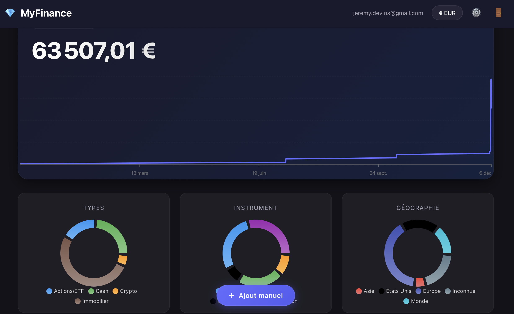
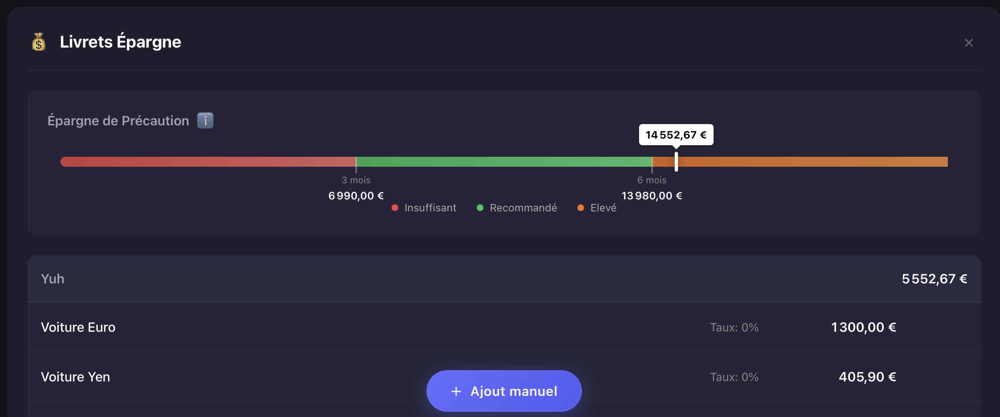
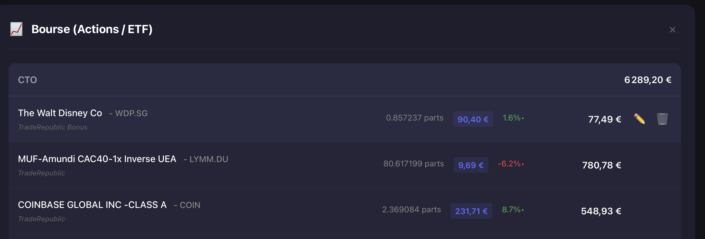

# MyFinance 💎

Dashboard personnel de suivi financier, entièrement sous ton contrôle.

## Fonctionnalités

- **Vue d'ensemble du patrimoine total** : Affichage en temps réel de la valeur totale de votre patrimoine
- **Changement de devise** : Possibilité de changer la devise d'affichage dans les paramètres (EUR, USD, GBP, CHF, JPY)
- **Catégories d'actifs** :
  - 💰 **Livrets Épargne** : Livret A, LDDS, PEL, etc.
  - 🏦 **Comptes Courants** : Multi-devises (EUR, USD, GBP, etc.)
  - 📈 **Bourse** : Actions et ETF avec suivi des performances
  - 🪙 **Crypto** : Bitcoin, Ethereum, Solana, etc.
  - 🏠 **Immobilier** : Appartements, maisons, locaux commerciaux

## Aperçu

### Dashboard Général


### Détail des Livrets (Épargne de précaution)


### Détail de la Bourse


## Technologies

- React 19
- TypeScript
- Vite 7

## Configuration

Ce projet utilise des variables d'environnement pour la configuration Firebase et la sécurité.
Avant de lancer le projet, vous devez créer un fichier `.env` à la racine du projet avec les clés suivantes :

```env
VITE_FIREBASE_API_KEY=votre_api_key
VITE_FIREBASE_AUTH_DOMAIN=votre_projet.firebaseapp.com
VITE_FIREBASE_PROJECT_ID=votre_projet_id
VITE_FIREBASE_STORAGE_BUCKET=votre_projet.firebasestorage.app
VITE_FIREBASE_MESSAGING_SENDER_ID=votre_sender_id
VITE_FIREBASE_APP_ID=votre_app_id
VITE_APP_SECRET_KEY=votre_cle_secrete_locale
```

## Démarrage

```bash
# Installation des dépendances
npm install

# Lancement en développement
npm run dev

# Build de production
npm run build

# Linting
npm run lint
```

## Structure du projet

```
src/
├── components/       # Composants React
│   ├── Dashboard.tsx
│   ├── CategoryCard.tsx
│   ├── CategoryDetail.tsx
│   ├── Header.tsx
│   └── Settings.tsx
├── contexts/         # Contextes React (CurrencyContext)
├── hooks/            # Hooks personnalisés (useAssets, useCurrency)
├── types/            # Types TypeScript
├── data/             # Données d'exemple
└── App.tsx           # Composant principal
```
